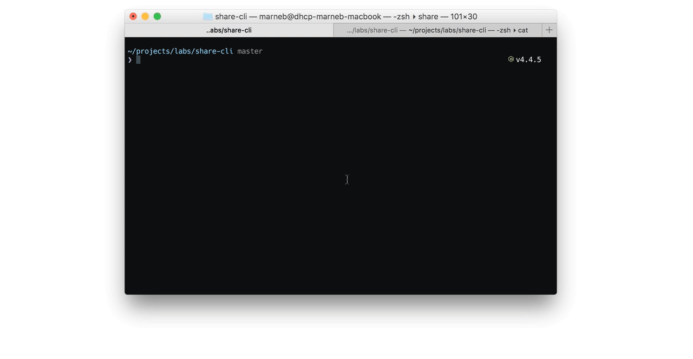

> Quickly share files from command line to your local network



# share-cli

* :rocket: Dead Simple
* :sparkles: Just works
* :lock: Local network only

share-cli exposes single files to your LAN via http, either from stdin or a given file.
The exposing address is copied to your clipboard automatically.

Afer a complete download or 5 minutes of inactivity share-cli closes automatically.

## Installation

```
npm install -g share-cli
```

## Usage

```
❯ share --help

  Quickly share files from command line to your local network

  Usage
    $ share [file]

  Options
    -n, --name Forced download name of the file

  Examples
    $ share shared.png
    http://192.168.1.1:1337/unequal-wish
 
    $ cat shared.png | share --name=shared.png
    http://192.168.1.1:1338/important-downtown
```

---
share-cli is built by [Mario Nebl](https://github.com/marionebl) and released
under the [MIT](./license.md) license.
